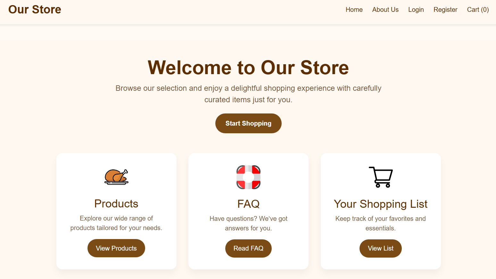
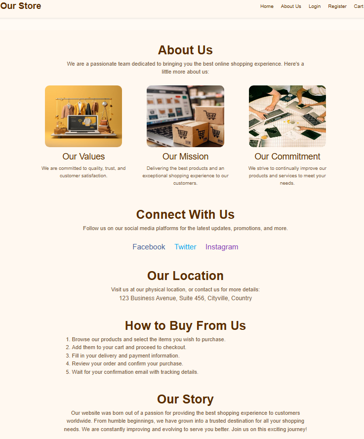
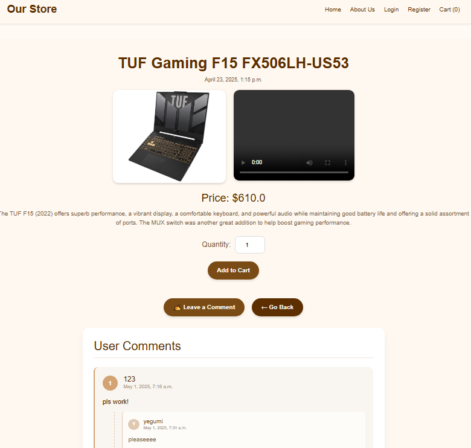

# E-commerce Project (Django + DRF)

This is a basic e-commerce web application built with Django and Django REST Framework (DRF), designed as a learning project. It includes both traditional Django views and selected API endpoints using DRF with JWT authentication.

### Features
- **User Authentication:** JWT-based login and registration
- **Product Listing:** Products are displayed by category
- **Cart & Orders:** Users can add items to cart and place orders
- **Admin Panel:** Uses Django’s default admin interface for managing products and orders
- **Mixed Views:** Most features are implemented in regular Django views; a portion is also exposed via DRF
- **Permissions:** Basic permissions are applied on the API side
- **Swagger Integration:** API documentation and testing via Swagger
- **Image Uploads:** Product images can be uploaded by admin
- ** Redis:** Keep track of last visited items by users with sessionkeys

This project isn’t a complete product, but it's a strong step toward mastering e-commerce app development with Django and DRF. Future improvements and advanced features will be explored in other projects.

## **Dockerized Setup**

This project is fully dockerized for easy setup and deployment. The docker-compose.yml file configures the following services:

Web: Runs the Django application inside a Docker container.

Postgres: Provides the database service.

Redis: Used for caching and other background tasks.

How to Run with Docker
Make sure you have Docker and Docker Compose installed.

Build and start the containers with:

docker-compose up --build

Access the app in your browser at http://localhost:8000.

To apply migrations inside the container, run:

docker-compose exec web python manage.py migrate

To collect static files, run:

docker-compose exec web python manage.py collectstatic --noinput

NOTES

Environment variables are loaded from your .env file (make sure to create it).
Database data is persisted using Docker volumes.

---

## **My Website Screenshots**
Here are some screenshots of different pages of my website:

### Home Page  

---

### last visited items  

---

### Register Page  

---

### Login Page  

---

### About Us Page  

---

### Product Page  

---

### Detail Page  

---

### Cart page

---
### Checkout Page  

---

